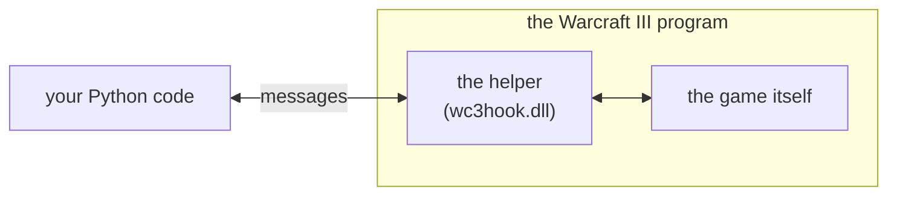
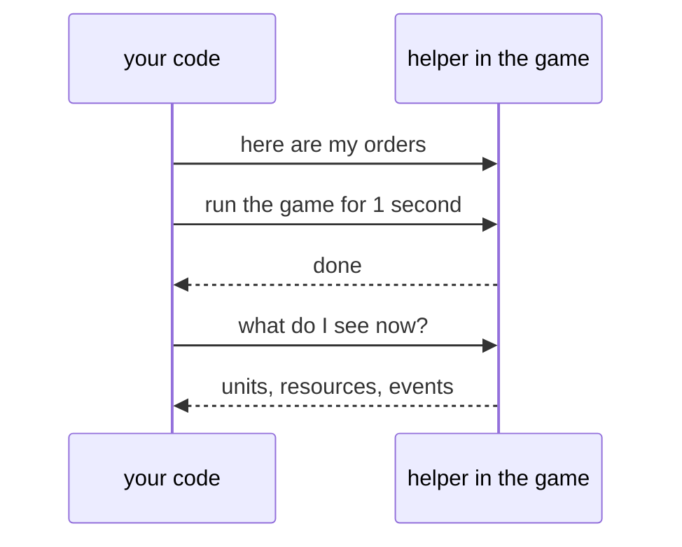
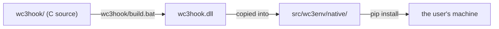

# How wc3env works

A plain-language tour. For the deep technical notes see [design](design.md).

## The idea

Warcraft III was made for people with a mouse and keyboard. It has no way for a program to
ask "what units do I have?" or say "move this one over there."

So we put a small helper *inside* the running game. From in there it can see everything the
game knows and can press the game's buttons from within. Your Python code never touches the
game directly; it just talks to the helper.

The messages are simple. Each one is a single line of text, such as "run for one second" or
"what does player 1 see?", and each gets a single line back. They travel over a private
channel between the two programs on your machine. Nothing goes over the network.

## What happens in a turn

Your code and the game take turns. You send your orders, tell the game to run for a bit, then
ask what you can see now.

In code, that whole exchange is one line: `obs, done, info = env.step(orders)`.

**Running the game for exactly one second** works because the helper holds the clock. A game
constantly asks the computer what time it is, and moves things according to the answer. The
helper steps in front of that question and answers it itself. When you say "run for one
second," it lets exactly one second of game time pass and then stops the clock again. While
the clock is stopped the game is frozen, so your code can think for a millisecond or a
minute and the game won't notice. It also means the helper can let that second pass as
quickly as the computer can manage, so a long match can play out in a fraction of real time.
And since the screen doesn't matter to a program, drawing can be switched off to go faster
still.

**Seeing** works by reading the game's own list of everything on the map: units, buildings,
items, trees. The helper goes through that list and keeps only what your player could
actually see. Anything under fog of war is left out, exactly as it would be for a person. It
also keeps a short history of things that happened in view, such as a unit dying or a spell
being cast. What comes back to Python is a plain description: each unit's type, position,
health and owner, plus your gold, lumber and food.

**Giving orders** goes through the same door a player's clicks go through. The helper writes
your order in the format the game uses for its own mouse clicks and drops it in the game's
order queue. The game then treats it like any other click, with all the normal rules: you
still need the gold, the target still has to be in range, the unit has to be yours. So an
order being *accepted* only means it was handed to the game, not that it succeeded. Orders
that are clearly wrong, like commanding someone else's unit, are turned away before they
reach the game, and you are told which ones.

## How a game starts, restarts and ends

Python starts Warcraft III **paused**, before it has run a single instruction. It slips the
helper into the paused program, waits for the helper to say "ready," and only then lets the
game run. Starting paused matters because it means the helper is in place before the game
does anything at all. Before any of this, Python checks that the game file is the exact
version the helper was built for, and refuses to continue if it isn't.

The game then loads and waits at the very start of the match. Python tells it which map to
play and which players your code controls, and the turns begin. The window stays out of the
way in the background and never grabs your mouse or keyboard.

A match ends when your players have won or lost. Calling `reset()` reloads the map without
closing the program, which takes a moment rather than a full launch. Warcraft III slowly
collects clutter in memory when reloaded many times, so every 32 matches Python quietly
closes it and starts a fresh copy. You don't have to do anything about this.

To run many games at once, Python simply starts many copies of Warcraft III, each with its
own helper, its own clock and its own folder for logs and replays. Normally the game refuses
to open twice; the helper takes care of that too.

## Where things live

`src/wc3env/` is the Python library you import. There are three ways in, from simplest up:
`WC3Env` is one AI player in one game, `GameSession` is one game with several AI players
taking their turns together, and `StepPool` is many separate games at once. The rest of the
folder is plumbing: starting the game, slipping the helper in, carrying the messages.

`wc3hook/` is the helper's source code, written in C. It sits outside `src/` because `src/`
is what gets installed on a user's machine, and nobody needs the C source to *use* the
library. Building turns that source into one file, `wc3hook.dll`, and copies it into
`src/wc3env/native/`. That built file is what ships.

`tests/` checks that it all works. Most tests don't need Warcraft III installed, because the
library includes a pretend helper with a tiny made-up world that answers the same messages
the real one does. That is also what the automated checks on GitHub run against. Tests
against the real game run on your own machine.

The remaining folders are optional. `tools/` holds scripts used while developing the
project, `docker/` runs the whole thing on Linux, and `wc3agent/` is a separate experiment:
an AI player built on top of wc3env.

## Limits worth knowing

The helper works by knowing exactly where things are inside one specific build of Warcraft
III, so that one build is the only one supported. And it is strictly offline: it never
connects to Battle.net and must not be used there.
